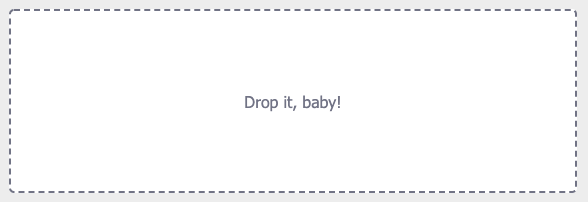
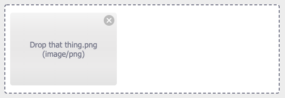

# gn-dropzone

A lightweight and highly customizable Angular dropzone component for file uploads.

[](https://www.npmjs.com/package/gn-dropzone)
[](https://travis-ci.com/peterfreeman/gn-dropzone)





For a demo see [DEMO](https://gn-dropzone.stackblitz.io). And the [CODE for the demo](https://stackblitz.com/edit/gn-dropzone).

## Install

```
$ npm install --save gn-dropzone
```

## Usage

```js
// in app.module.ts
import { NgxDropzoneModule } from 'gn-dropzone';

@NgModule({
  ...
  imports: [
    NgxDropzoneModule
  ],
  ...
})
export class AppModule { }
```

```html
<!-- in app.component.html -->
<gn-dropzone (change)="onSelect($event)">
	<gn-dropzone-label>Drop it, baby!</gn-dropzone-label>
	<gn-dropzone-preview *ngFor="let f of files" [removable]="true" (removed)="onRemove(f)">
		<gn-dropzone-label>{{ f.name }} ({{ f.type }})</gn-dropzone-label>
	</gn-dropzone-preview>
</gn-dropzone>
```

```js
// in app.component.ts
files: File[] = [];

onSelect(event) {
  console.log(event);
  this.files.push(...event.addedFiles);
}

onRemove(event) {
  console.log(event);
  this.files.splice(this.files.indexOf(event), 1);
}
```

You can also use special preview components to preview images or videos:

```html
<gn-dropzone-image-preview ngProjectAs="gn-dropzone-preview" *ngFor="let f of files" [file]="f">
  <gn-dropzone-label>{{ f.name }} ({{ f.type }})</gn-dropzone-label>
</gn-dropzone-image-preview>
```

```html
<gn-dropzone-video-preview ngProjectAs="gn-dropzone-preview" *ngFor="let f of files" [file]="f">
  <gn-dropzone-label>{{ f.name }} ({{ f.type }})</gn-dropzone-label>
</gn-dropzone-video-preview>
```

## Component documentation

#### gn-dropzone

This component is the actual dropzone container. It contains the label and any file previews.
It has an event listener for file drops and you can also click it to open the native file explorer for selection.

Use it as a stand-alone component `<gn-dropzone></gn-dropzone>` or by adding it as an attribute to a custom `div` (`<div class="custom-dropzone" gn-dropzone></div>`).
It will add the classes `ngx-dz-hovered` and `ngx-dz-disabled` to its host element if necessary. You could override the styling of these effects if you like to.

This component has the following Input properties:

* `[multiple]`: Allow the selection of multiple files at once. Defaults to `true`.
* `accept`: Set the accepted file types (as for a native file element). Defaults to `'*'`. Example: `accept="image/jpeg,image/jpg,image/png,image/gif"`
* `[maxFileSize]`: Set the maximum size a single file may have, in *bytes*. Defaults to `undefined`.
* `[disabled]`: Disable any user interaction with the component. Defaults to `false`.
* `[expandable]`: Allow the dropzone container to expand vertically as the number of previewed files increases. Defaults to `false` which means that it will allow for horizontal scrolling.
* `[disableClick]`: Prevent the file selector from opening when clicking the dropzone.
* `[id], [aria-label], [aria-labelledby]`, `[aria-describedby]`: Forward the accessibility properties to the file input element.

It has the following Output event:

* `(change)`: Emitted when any files were added or rejected. It returns a `NgxDropzoneChangeEvent` with the properties `source: NgxDropzoneComponent`, `addedFiles: File[]` and `rejectedFiles: RejectedFile[]`.

The `RejectedFile` extends the native File and adds an optional reason property to tell you why the file was rejected. Its value will be either `'type'` for the wrong acceptance type, `size` if it exceeds the maximum file size or `no_multiple` if multiple is set to false and more than one file is provided.

If you'd like to show the native file selector programmatically then do it as follows:

```html
<gn-dropzone #drop></gn-dropzone>
<button (click)="drop.showFileSelector()">Open</button>
```

#### gn-dropzone-label

This component has no attributes or methods and acts as a container for the label text using content projection.
You can place anything inside of it and the text will always be centered.

#### gn-dropzone-preview

This component shows a basic file preview when added inside the dropzone container. The previews can be focused using the tab key and be deleted using the backspace or delete keys.

This component has the following Input properties:

* `[file]`: The dropped file to preview.
* `[removable]`: Allow the user to remove files. Required to allow keyboard interaction and show the remove badge on hover.

It has the following Output event:

* `(removed)`: Emitted when the element should be removed (either by clicking the remove badge or by pressing backspace/delete keys). Returns the file from the Input property.

The `gn-dropzone-image-preview` and `gn-dropzone-video-preview` components inherit from this component but expand the preview functionality to display either images or videos directly in the component. See the [wiki](https://github.com/peterfreeman/gn-dropzone/wiki/How-to-create-a-custom-preview-component%3F) on how to implement your own custom preview components.

#### gn-dropzone-remove-badge

This component is used within the previews to remove selected files. You can use it within your own preview component implementation if you like (see the wiki).

## Other

[How to upload a file to a Web API?](https://github.com/peterfreeman/gn-dropzone/wiki/How-to-upload-a-file-to-a-Web-service-API%3F)

## Licence

MIT © Peter Freeman
"# gn-dropzone" 
